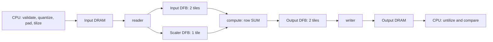

# Design: a bounded BF16 row sum

For a logical `M×N` matrix, the project computes one sum per row on one Wormhole
Tensix node. The C++ host uses the pinned Metal 2.0 `ProgramSpec`,
`DataflowBufferSpec`, `KernelSpec`, `MakeProgramFromSpec` and `SetProgramRunArgs`
interfaces throughout. Source adaptations and exact upstream references are in
[source-notes.md](source-notes.md); validation results are described in
[validation.md](validation.md).

## Data and numerical contract

Dimensions are integers in `[1,128]`, and the node count is exactly one. The
host rejects empty/oversize shapes, multiplication overflow, mismatched input
length, NaN/Inf and unsupported values before device creation or upload. After
BF16 round-to-nearest-even quantization, each input must be zero or have
absolute value in `[2^-8,1]`. This is a project scope choice.

For each uploaded BF16 value `q[i,j]`, the CPU reference is
`s[i] = Σ double(q[i,j])`, and `A[i] = Σ abs(double(q[i,j]))`. The oracle begins
with the actual quantized bits, because the original float input may differ.
Zeros, one-hot, ones, paired cancellation and small-integer patterns require
exact output values; either sign of zero is accepted. Decimal and seeded
random patterns use the predeclared budget:

```text
u32 = 2^-24, ub = 2^-8
gamma = (N + 64) * u32 / (1 - (N + 64) * u32)
abs(actual[i] - s[i]) <= ub * abs(s[i]) + (1 + ub) * gamma * A[i] + 2^-20
```

This is an acceptance budget for this bounded project, not a proved ISA-wide
error bound. The configuration is `HiFi4`, `enable_32_bit_dest=true`,
`DST_ACCUM_MODE=1`, `MATH_ONLY=0`, `REDUCE_DIM=ReduceDim::REDUCE_ROW` and
`REDUCE_OP=PoolType::SUM`, together with the explicit FP32 template argument.
Failure requires investigation; the checker does not widen the budget.
Every comparison rejects non-finite inputs or outputs and records absolute
error, `abs(error)/max(A[i],2^-20)`, the threshold and failing row indices.

## Physical layout

The physical dimensions are `Mp=32*ceil(M/32)` and `Np=32*ceil(N/32)`. All
positions outside the logical matrix contain positive zero, the identity for
sum. Tiles are row-major in the tile grid; each 32×32 tile stores four 16×16
faces in top-left, top-right, bottom-left, bottom-right order. Within each face,
values are row-major. For a physical coordinate `(r,c)`:

```text
tile = (r / 32) * (Np / 32) + c / 32
face = ((r % 32) / 16) * 2 + (c % 32) / 16
index = tile * 1024 + face * 256 + (r % 16) * 16 + c % 16
```

The host uses the upstream tilizer and compares it with an independent index
implementation. BF16 conversion is cross-checked against upstream as well.
Two BF16 words form one `UINT32` raw transfer word; the DFB format remains
`Float16_b` (BF16). The transfer TensorSpec therefore describes storage, not a
change in the mathematical dtype.

`REDUCE_ROW` produces one output tile for every tile-row of input. Logical row
sums occupy column zero; other columns and padded rows must be zero. The host
untilizes before selecting the first column. The runner independently decodes
the complete raw output tile bytes, checks these zero slots and verifies that
the displayed actual vector equals the BF16 readback.

For 33×33, `Mp=Np=64`: four input tiles produce two output tiles. The static
transfer ledger is `2*Mp*Np=8192` input bytes and `2*32*Mp=4096` output bytes.
These counts cover the algorithm's input/output payloads; they exclude scaler
setup, output poisoning, host readback and protocol traffic. They are not a
measurement of DRAM traffic.

## Three kernels and one program lifetime



The reader constructs the pinned reduction scaler and reads one input tile at
a time. `reserve_back → async_read → read_barrier → push_back` publishes only
complete data. The compute kernel consumes each tile in a tile-row, accumulates
all `Wt` partial sums in FP32 Dest and packs once to BF16. Wormhole row SUM
requires the reference implementation's scaler/data format swap before
`reduce_init`. The writer follows `wait_front → async_write → write_barrier →
pop_front`, so storage cannot be reused before the write completes.

The host owns mesh, tensors and workload until `Finish` and readback complete.
Every invocation supplies the full runtime argument table. `Ht`, `Wt` and
`NC` are compile-time specializations; changing them requires a new program specialization. For repeat testing, the same
mesh, tensors and workload remain live while the next input changes. Before
every launch the host poisons the entire output with NaNs; missing writes and
stale results cannot pass an all-zero case accidentally.

## Validation and measurement

The CPU suite exercises all seven patterns across the 12 required shapes,
layout round-trips and face boundaries, input rejection and deliberately
incorrect results. The ttsim matrix runs these
12 logical shapes with recorded patterns and seeds:

```text
1×1, 1×31, 1×32, 1×33, 31×31, 32×32,
32×33, 33×32, 33×33, 65×97, 97×65, 128×128
```

A separate 33×33 process executes twice with different inputs. Processes run
serially because the simulator has process-level initialization and fatal
error semantics. Timeouts terminate the process group and retain logs and
elapsed time. The runner checks the official simulator digest and Metal HEAD,
captures binary/source hashes, and refuses to overwrite evidence. It
regenerates every pattern, including the specified `std::mt19937` sequence,
from the recorded seed. Each record includes the raw BF16 bytes, actual/reference vectors and source
identity for later checks.

| Stage | Required evidence |
| --- | --- |
| C0 | CPU reference/layout/contract tests |
| C1 | Real Metal host target compiles and links |
| C2 | This project's device JIT/ELF succeeds |
| C3 | This project's full simulator matrix and changed-input reuse pass |
| C4 | Real silicon execution and appropriate measurement; unavailable here |

`wall_seconds` includes process startup, JIT/cache effects, simulation and
teardown. The host's `execute_wall_seconds` covers enqueue through `Finish`
and excludes transfers. Both are simulator observations when using ttsim.
Three coarse `DeviceZoneScopedN` scopes provide profiler hooks; Mesh profiler
readback produces a CSV only if the execution environment supports it. The
checker requires complete project zones and labels counters
`simulator_instrumentation`. These counters describe simulation and do not measure silicon
latency, bandwidth or speedup.
